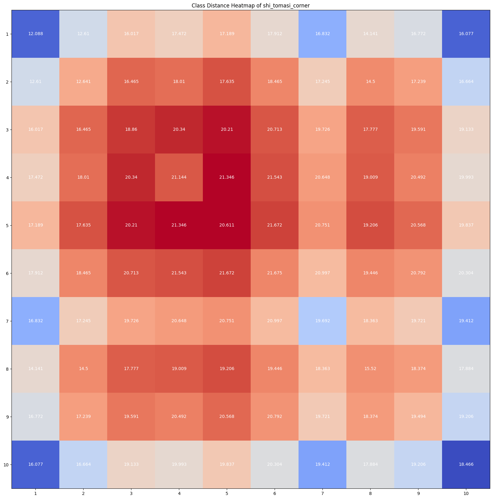

# CMPE 544 Project-Phase 1

Code location [https://github.com/alpsark/cmpe-SVHN](https://github.com/alpsark/cmpe-SVHN), note [test_32x32.mat](http://ufldl.stanford.edu/housenumbers/test_32x32.mat) and [train_32x32.mat](http://ufldl.stanford.edu/housenumbers/train_32x32.mat) needs to be downloaded because they were too large to put in git. 


## 1 Dataset

**In this project, you will be using The Street View House Numbers (SVHN) dataset 1. The SVHN dataset comprises ten classes and over 600,000 labeled digit images of size 32 × 32. You may consider it as MNIST in the wild. A selection from the dataset is shown below. You may download and import the dataset using a data loader from any library. When you load the dataset, you should see train and test splits of 73,257 and 26,032 images, respectively.**

Images are downloaded and imported successfully.

```py
print ("test mat size is " + str(test_mat['y'][:].size))
print ("train mat size is " + str(train_mat['y'][:].size))
```

test mat size is 26032  
train mat size is 73257


## 2 Feature Extraction
### 2.1.1 Challenging cases
**Are there any challenging cases in the SVHN dataset? Please discuss and provide example images if necessary.**

*   Blurry images (Label is 6)  
  
- Low contrast images   (Label is 3)    
  
- Images with multiple numbers  (Label is 1)    


### 2.1.2 Five techniques
**Investigate traditional feature extraction techniques. Choose at least five techniques and extract five different sets of features for the SVHN dataset. Among the five techniques, there could be ones you design.**

Feature extractions investigated from sublibraries:   

* [https://scikit-image.org/docs/stable/api/skimage.feature.html](https://scikit-image.org/docs/stable/api/skimage.feature.html) 
* [https://scikit-image.org/docs/stable/api/skimage.filters.html](https://scikit-image.org/docs/stable/api/skimage.filters.html) 

To avoid redundancy between features I wanted to extract as much as different kinds of information. To do this I have categorized different algorithms according to their purpose and choose the best method from each category. To choose the best method for SVHN I have checked their **mutual information scores** [@10.1371/journal.pone.0087357] which  quantifies the degree of dependency between features and labels. It takes too much time to check all 73257 values so I have used random 10000 values to compare & choose feature vectors.  Simplest feature vector that we can use is grayscale, so all other chosen features must have higher mutual information scores than that. After I have extracted the feature I have scaled  them (by substracting the mean and dividing by variance using ```sklearn.preprocessing.StandardScaler```) so that all features have zero mean  and unit variance.  Since we dont have a missing data, so we dont need to use any impute function. 

Original: 


Grayscale (Base feature):

 

1) Edge Detection:
    1) Farid transform filter  
 
    2) Laplace operator filter  
 
    3) Prewitt transform filter    
 
    1) **Roberts' cross operator filter**   
   
    1) Scharr transform filter    
   
    1) Sobel filter  
   
    1) Canny algorithm filter  
 
1) Local Binary Patterns (LBP):  
    1) **original local binary pattern LBP**  (grayscale invariant but not rotation invariant)  
 
    2) rotation-invariant uniform Extension of default pattern (grayscale invariant and rotation invariant.)  
 
    4) uniform local binary pattern LBP (grayscale invariant and rotation invariant)  
   
    1) non-rotation-invariant uniform local binary pattern LBP  (grayscale invariant and but not rotation invariant)  
 
1) Corner detection
    1) Features from accelerated segment test corners for a given image.   
 
    2) Compute Harris corner measure response image.  
 
    3) Compute Kitchen and Rosenfeld corner measure response image.  
 
    4) Compute Moravec corner measure response image.  
 
    5) **Compute Shi-Tomasi (Kanade-Tomasi) corner measure response image**   
 
1) Other Filters
    1) Hessian filter  
   
    2) Meijering filter  
   
    3) sato filter  
   
    4) frangi filter  
   
    1) **gabor filter **   
   
1) Other Algoritms
    1) **daisy ((Descriptor for Attenuated and Augmented Scale-Invariant Keypoints)**  
    
    1)  Histogram of Oriented Gradients  
    

**Feature extractions chosen:  **

* Roberts' cross operator edge detection filter  
* Local binary pattern LBP [@1017623]  
* Compute Shi-Tomasi (Kanade-Tomasi) corner measure response image  [@323794] 
* Gabor filter  [@Gabor1946]
* Daisy (Descriptor for Attenuated and Augmented Scale-Invariant Keypoints)  [@Tola2010]

### 2.2 Compare the distinctiveness

 **Compare the distinctiveness of the features you extracted. You will not yet learn about dimensionality reduction or clustering in the first phase. Therefore, come up with an evaluation approach where you quantify the distinctiveness of the features from five different techniques. Based on your metric, please discuss which features you would prefer to use for further tasks.**

I have used mutual information [@10.1371/journal.pone.0087357] as a measure of distinctiveness. This algorithm compares features and supervised labels to measure their dependency. Zero score means they are completely independent values, and highest score means it is the most distinct feature. This algorithm can be used to weed out irrelevant features. I have cutoff fewer then mean of Mutual Information in all features to make calculations easy.

Mutual information scores for 73257 training data with the chosen features:


Mutual information scores after lower than mean is cropped , as can be seen scores are increased ~x2:


Feature sizes are:

* roberts &nbsp;  &nbsp;  &nbsp;  &nbsp;  &nbsp;  &nbsp;  &nbsp;  &nbsp;   &nbsp;         :  1024 -> 339
* lpb   &nbsp;  &nbsp;  &nbsp;  &nbsp;  &nbsp;  &nbsp;  &nbsp;  &nbsp;  &nbsp;  &nbsp;  &nbsp;  &nbsp;             :  1024 -> 395
* shi_tomasi_corner :  1024 -> 315
* gabor   &nbsp;  &nbsp;  &nbsp;  &nbsp;  &nbsp;  &nbsp;  &nbsp;  &nbsp;  &nbsp;  &nbsp;           :  1024 -> 376
* daisy   &nbsp;  &nbsp;  &nbsp;  &nbsp;  &nbsp;  &nbsp;  &nbsp;  &nbsp;  &nbsp;  &nbsp;  &nbsp;:  200 &nbsp; -> 83

I will use all of the reduced features combined as a feature for classification. So my feature vector has 339+395+315+376+83 = 1508 values. 

### 2.3 Intra-inter Class

**For the features of your choice, investigate if there are any classes with low intra-class and high inter-class similarities. Detect the problematic categories that might lead to misclassification errors, if there are any.**

I have used Euclidean distance ( $||u - v||_{2}=\sqrt{\sum{(u_i - v_i)^2}}$ ) as metric for similarity. Heatmap of the distances are given below: 

* Roberts  
Roberts can distinguish the 2,3,5,6 and 8 very well.  However 7 and 1 are mixing up with each other. 9 is mixed up as 8.   10 is not distinguishable at all.     
  
* LBP    
LBP on the other hand can distinguish 7s and 1s from each other. In fact it is the most distinguishable pair.   
  
* Shi-Tomasi   
Shi-Tomasi is particularly bad with detecting 5,7 and 10 and mixes up with 1. 1s are detecting as 1s. 
  
* Gabor  
Gabor can detect 1 really well.  But for others are not very effective. 
  
* Daisy  
Daisy mixes up 4s and 7s, but can detect 6,9 and 10s particularly well. 
  

All feature extraction methods has its benefits and disadvantages. That is why I am combining all features as a single feature vector. 

## 3 Classification

### Preprocessing pipeline

Preprocessing pipeline consist of StandartScalater that scales the feature vectors to have zero mean  and unit variance and selector that select the features that has mutual information above the mean. This is applied to all features in parallel and then outputs combined as a single feature.    


### KNN

**(10 pts) Please try to use the non-parametric k-Nearest Neighbors (k-NN) classifier. Please comment on the challenges you encounter while training the k-NN classifier. You may use libraries, but you should be able to answer questions about the techniques that the function you use implements in the background. Please focus on how k-NN is implemented for large-scale datasets such as SVHN.**

KNN algorithm was quite slow for 73,257 labels ,even after trimming $1-(1508/4096)=64%$ of the feature vectors.   


Score is : 0.7269130301167793

### linear discriminant functions 

**20 pts) Please use linear discriminant functions for classification. Please compare the performances for different linear discriminant functions and classification with non-linear transformations. Please plot and comment on the convergence of each method you try. Please discuss your strategy to determine the hyperparameters.**

Hyperparameters are tuned through cross-validation. 

#### Linear - Support Vector Machine (SVM) Linear Kernel:


Code is there but didnt have time for meaningful outputs and try with different epocs.

**(10 pts) Do you observe underfitting? Please suggest ways to overcome it and apply your suggestions. If necessary, you may go back to exploring better feature extraction techniques at this point. Please report the changes you made in the feature extraction part. If you observe overfitting, please use regularization to overcome it. Please repeat (2) with the regularized models.**


## 4 Metric Learning

**In this section, you will use Scale Invariant Feature Transform (SIFT) features.
**

### SIFT

**20 pts) Please implement a distance metric learning framework from scratch. Your goal is to learn a linear projection to map SIFT features into a new space where the Euclidean distance between the samples in the same category will be minimized, and the distance between samples from different categories will be maximized. Please provide your metric learning algorithm in your report. You must design the loss function and any extra terms needed to regularize the training. Make sure the learned distance function will be a valid distance metric.**

My loss function is (f is the feature vector): 

$$ L (f) =  \sum_{i}{(\sum_{j=i(i=j)}||f(i) - f(j)||_2 - \sum_{j=i(i\ne j)}||f(i) - f(j)||_2)} $$

Distance metric learning framework is the similar to single layer neural network without any activation function. This is why I have coded as such. 
I have coded a stochastic gradient descent as an iterator of weights. So overall metric learning framework uses gradient descent algorithm to optimize weight to find the best loss function. weight are the projection matrix to change feature vector dimensions. 

Code is there but I didnt have time for meaningful outputs.
 **(10 pth) Train your metric learning framework with the training split of SVHN. Apply the learned projection onto SIFT features of the training and test splits. Then, train the best classifier from Section 3 with the new features and report the performance. Could you improve the performance**


# References